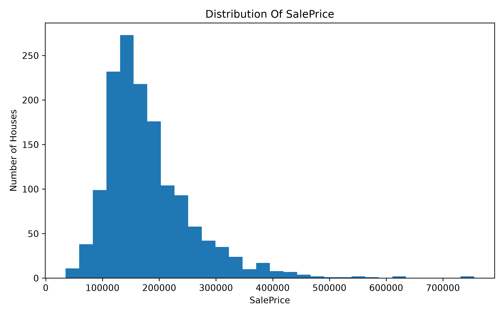
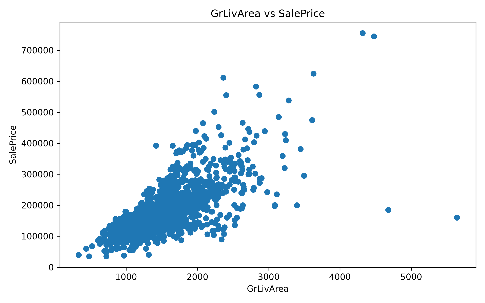
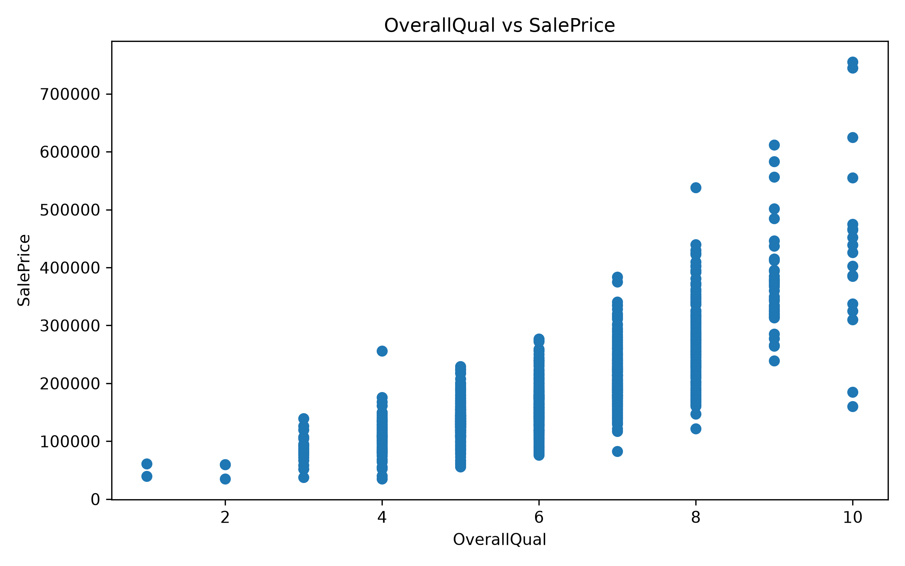
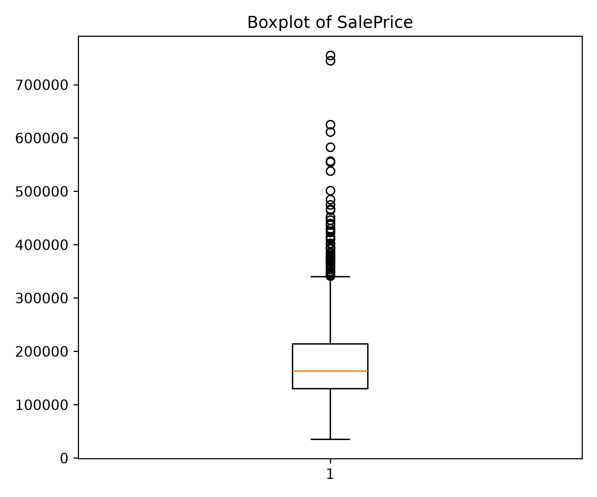
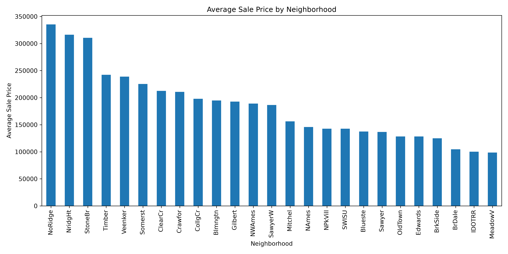

# House Price Predictor

## Project Overview

This project explores the Ames Housing dataset and develops a machine learning model for predicting house sale prices.

The project follows a complete machine learning workflow:

- Data loading and inspection
- Data cleaning
- Exploratory data analysis
- Feature preparation
- Model training
- Model evaluation and comparison

## Dataset

The dataset contains 1,460 residential properties and 81 features describing characteristics such as:

- Living area
- Overall construction quality
- Garage capacity
- Basement size
- Neighborhood
- Year built
- Sale price

The target variable is `SalePrice`.

## Project Structure

```text
House-price-predictor/
│
├── Data/
│ ├── raw/
│ └── processed/
├── images/
├── House_Price_EDA.ipynb
├── README.md
├── requirements.txt
└── .gitignore
```

## Data Cleaning

Missing values were handled according to their meaning rather than applying one method to every column.

- Categorical values representing the absence of a feature were filled with `"None"`.
- `GarageYrBlt` was filled with 0 for houses without a garage, allowing the model to distinguish between houses with and without garage structures.
- `MasVnrArea` was filled with 0 for houses without masonry veneer, since a missing value represented the absence of the feature rather than missing information.
- `LotFrontage` was imputed using the median LotFrontage value within each neighborhood.This approach preserves neighborhood-specific characteristics and reduces the influence of extreme values compared to using the overall mean.
- The single missing `Electrical` value was filled using the mode.

## Exploratory Data Analysis

### Sale Price Distribution

`SalePrice` is positively skewed. Most houses are concentrated in the lower and middle price ranges, while a smaller number of expensive houses create a long right tail.



### GrLivArea and SalePrice

There is a clear positive relationship between above-ground living area and sale price. Larger houses generally sell for more, although a few outliers are present.



### Overall Quality and SalePrice

`OverallQual` has the strongest positive correlation with `SalePrice`. Houses with higher overall quality ratings generally sell for higher prices.



### Sale Price Outliers

The box plot shows several high-priced outliers. These observations were not removed automatically because they may represent genuine luxury properties.



### Neighborhood Differences

Average sale prices vary considerably across neighborhoods. `NoRidge` has the highest average sale price, while `MeadowV` has the lowest.



## Key Findings

- `OverallQual` has the strongest positive correlation with `SalePrice`.
- Larger above-ground living areas are generally associated with higher prices.
- Garage capacity, basement size, and first-floor area are also important numerical features.
- Newer and recently remodeled houses tend to sell for more.
- Neighborhood appears to be an important categorical predictor.
- `SalePrice` contains several valid high-value outliers.

## Technologies Used

- Python
- Pandas
- NumPy
- Matplotlib
- Seaborn
- Scikit-learn
- Jupyter Notebook

## Model Comparison

Three regression models were trained and evaluated using the same training and testing data.

| Model             |        MAE |       RMSE |  R² Score |
| ----------------- | ---------: | ---------: | --------: |
| Linear Regression |     20,303 |     33,259 |     0.856 |
| Decision Tree     |     26,825 |     42,276 |     0.767 |
| **Random Forest** | **17,779** | **29,210** | **0.889** |

The Random Forest Regressor achieved the best overall performance and was selected as the best-performing model.

# How to Run

Clone the repository:

```bash
git clone https://github.com/Kasias1/house-price-predictor.git
cd House-price-predictor
```

Create a virtual environment:

```bash
python -m venv .venv
```

Activate the virtual environment:

** Windows - Git Bash **

```bash
source .venv/Scripts/activate
```

** Windows - Powershell**

```powershell
.venv\Scripts\Activate.ps1
```

**macOS/Linux**

```bash
source .venv/bin/activate
```

Install the dependencies and open the notebook:

```bash
python -m pip install -r requirements.txt
jupyter notebook
```

## Conclusion

This project demonstrates an end-to-end machine learning workflow, from data cleaning and exploratory analysis to model training and evaluation. Among the models tested, the Random Forest Regressor achieved the best performance and was selected as the final model.
